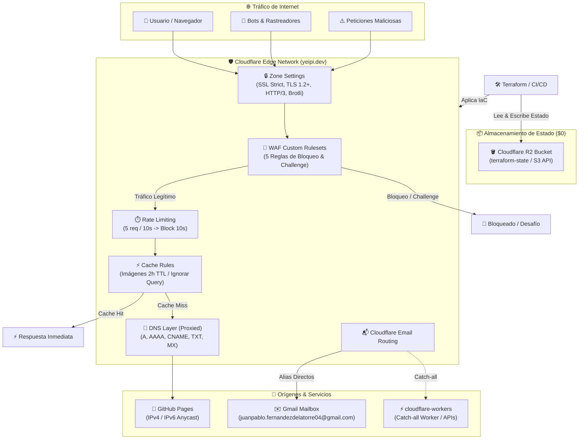

# 🌐 Cloudflare Infrastructure (`cloudflare-infra`)

Infraestructura como Código (IaC) modular y reproducible con **Terraform / OpenTofu** utilizando el **Cloudflare Provider v5 (`~> 5.0`)** para gestionar la zona DNS, seguridad perimetral (WAF Custom Rules, Rate Limiting), optimización de caché, Email Routing y configuraciones globales para el dominio **[`yeipi.dev`](https://yeipi.dev)**.

El estado remoto (`terraform.tfstate`) se almacena de forma segura y sin costes en **Cloudflare R2** utilizando el protocolo compatible con Amazon S3.

---

## 🏛️ Arquitectura Global



### 🔗 Relación con el Repositorio Hermano `cloudflare-workers`

Este repositorio (`cloudflare-infra`) gestiona la **capa de infraestructura base y zona DNS** de Cloudflare. Se complementa con el repositorio **[`cloudflare-workers`](https://github.com/yeipis/cloudflare-workers)** de la siguiente manera:
1. **DNS & Enrutamiento:** `cloudflare-infra` declara los registros DNS y las reglas perimetrales.
2. **Email Catch-All Worker:** El worker serverless `email-catch-all-reject` (encargado de filtrar y rechazar correos no autorizados) se desarrolla y despliega desde `cloudflare-workers`. Una vez desplegado, se enlaza como destino del Catch-all en Email Routing.

---

## 📁 Estructura del Repositorio

```text
cloudflare-infra/
├── .github/
│   └── workflows/
│       ├── terraform-check.yml       # Validación, linting y plan en PRs
│       └── terraform-deploy.yml      # Despliegue (apply) automático en main
├── modules/
│   ├── dns/                          # Gestión de registros A, AAAA, CNAME, MX, TXT
│   │   ├── main.tf
│   │   ├── variables.tf
│   │   └── outputs.tf
│   ├── rulesets/                     # WAF Custom, Rate Limiting y Cache Rules
│   │   ├── main.tf
│   │   ├── variables.tf
│   │   └── outputs.tf
│   ├── email/                        # Reglas de reenvío de Email Routing
│   │   ├── main.tf
│   │   ├── variables.tf
│   │   └── outputs.tf
│   └── zone-settings/                # SSL Strict, TLS 1.2, HTTP/3, Brotli
│       ├── main.tf
│       ├── variables.tf
│       └── outputs.tf
├── .gitignore                        # Protección contra fuga de secretos y estado
├── LICENSE                           # Licencia MIT
├── README.md                         # Documentación técnica de arquitectura y uso
├── backend.tf                        # Configuración del backend S3 para Cloudflare R2
├── backend.tfvars.example            # Plantilla para credenciales de backend R2
├── main.tf                           # Orquestador raíz que invoca todos los módulos
├── variables.tf                      # Definición de variables globales
├── outputs.tf                        # Salidas e identificadores de recursos
├── terraform.tfvars.example          # Plantilla para variables de Terraform
└── versions.tf                       # Requisitos de Terraform >= 1.5.0 y Provider ~> 5.0
```

---

## 🛡️ Seguridad y Buenas Prácticas para Repositorio Público

> [!IMPORTANT]
> Este repositorio está diseñado para ser **100% público y seguro**. No contiene ningún token, contraseña o identificador sensible en el código versionado.

* **Archivos ignorados en Git:** `terraform.tfvars`, `backend.tfvars`, `.terraform/`, `*.tfstate`, `.env*`.
* **Plantillas públicas:** Se proporcionan `terraform.tfvars.example` y `backend.tfvars.example` para facilitar la configuración local.
* **Principio de menor privilegio:** Los tokens de Cloudflare deben restringirse a la zona `yeipi.dev` con permisos específicos de edición.

---

## 🪣 Configuración del Backend en Cloudflare R2 ($0 Cost)

Para guardar el archivo de estado `terraform.tfstate` de manera remota y colaborativa en **Cloudflare R2**:

1. Entra al **Cloudflare Dashboard** > **R2 Object Storage**.
2. Crea un bucket llamado **`terraform-state`**.
3. En la barra lateral de R2, haz clic en **Manage R2 API Tokens** > **Create API Token**:
   * **Permissions:** `Object Read & Write`
   * **Apply to specific bucket:** `terraform-state`
   * **TTL:** Según tu preferencia (o sin expiración para CI/CD)
4. Guarda las credenciales generadas:
   * **Access Key ID** (`AWS_ACCESS_KEY_ID`)
   * **Secret Access Key** (`AWS_SECRET_ACCESS_KEY`)
   * **Endpoint URL:** `https://<TU_ACCOUNT_ID>.r2.cloudflarestorage.com`

---

## 🚀 Guía de Uso Local

### 1. Clonar el Repositorio
```bash
git clone https://github.com/yeipis/cloudflare-infra.git
cd cloudflare-infra
```

### 2. Configurar Variables Locales

Copia las plantillas de ejemplo:
```bash
# En Windows (PowerShell)
Copy-Item terraform.tfvars.example terraform.tfvars
Copy-Item backend.tfvars.example backend.tfvars

# En Linux / macOS
cp terraform.tfvars.example terraform.tfvars
cp backend.tfvars.example backend.tfvars
```

Edita `terraform.tfvars` con tus credenciales:
```hcl
cloudflare_api_token  = "tu_token_de_cloudflare_aqui"
cloudflare_account_id = "tu_account_id_aqui"
cloudflare_zone_id    = "tu_zone_id_aqui"
domain                = "yeipi.dev"
destination_email     = "juanpablo.fernandezdelatorre04@gmail.com"
```

Edita `backend.tfvars` con tus credenciales de R2:
```hcl
endpoint   = "https://<TU_ACCOUNT_ID>.r2.cloudflarestorage.com"
access_key = "tu_r2_access_key_id"
secret_key = "tu_r2_secret_access_key"
```

### 3. Inicializar y Ejecutar Terraform

#### En Windows (PowerShell):
```powershell
# Inicializar conectando al backend R2
terraform init -backend-config=backend.tfvars

# Validar sintaxis y configuración
terraform validate

# Previsualizar cambios
terraform plan

# Aplicar infraestructura
terraform apply
```

#### En Linux / macOS (Bash):
```bash
# Inicializar con backend R2
terraform init -backend-config=backend.tfvars

# Validar sintaxis y configuración
terraform validate

# Previsualizar cambios
terraform plan

# Aplicar infraestructura
terraform apply
```

---

## 🤖 CI/CD con GitHub Actions

El repositorio incluye dos flujos de trabajo automatizados en `.github/workflows/`:

1. **`terraform-check.yml` (Pull Requests):**
   * Se dispara ante cualquier PR hacia la rama `main`.
   * Realiza comprobación de formato (`terraform fmt -check`), inicialización contra R2, validación (`terraform validate`) y generación de `terraform plan`.
2. **`terraform-deploy.yml` (Deploy en Main):**
   * Se dispara automáticamente tras mergear a `main`.
   * Ejecuta `terraform apply -auto-approve` aplicando los cambios en Cloudflare.

### Configuración de Secretos en GitHub

En tu repositorio de GitHub, ve a **Settings** > **Secrets and variables** > **Actions** y añade los siguientes **Repository Secrets**:

| Nombre del Secreto | Descripción | Ejemplo / Origen |
| :--- | :--- | :--- |
| `CLOUDFLARE_API_TOKEN` | Token API de Cloudflare con permisos de edición | Token con permisos Zone, DNS, WAF, Email |
| `CLOUDFLARE_ACCOUNT_ID` | Account ID de tu cuenta de Cloudflare | Visible en la URL o dashboard |
| `CLOUDFLARE_ZONE_ID` | Zone ID del dominio `yeipi.dev` | Visible en la vista general de la zona |
| `AWS_ACCESS_KEY_ID` | Access Key ID del Token R2 | Credenciales S3 generadas en R2 |
| `AWS_SECRET_ACCESS_KEY` | Secret Access Key del Token R2 | Credenciales S3 generadas en R2 |

---

## 📋 Recursos y Módulos Gestionados

### 1. DNS (`modules/dns/`)
Gestionado mediante `cloudflare_dns_record` (v5):
* **Registros A (GitHub Pages IPv4, Proxied):** `185.199.111.153`, `185.199.110.153`, `185.199.109.153`, `185.199.108.153`.
* **Registros AAAA (GitHub Pages IPv6, Proxied):** `2606:50c0:8000::153`, `2606:50c0:8001::153`, `2606:50c0:8002::153`, `2606:50c0:8003::153`.
* **CNAMEs (Proxied):**
  * `greenfleet.yeipi.dev` -> `yeipi.dev`
  * `parkit.yeipi.dev` -> `yeipi.dev`
  * `poketools.yeipi.dev` -> `yeipi.dev`
  * `www.yeipi.dev` -> `yeipis.github.io`
* **Registros MX (Email Routing):** Prioridades 1 (`route2`), 27 (`route1`), 36 (`route3`).
* **Registros TXT:** DKIM (`cf2024-1._domainkey`), DMARC (`_dmarc`), verificación de GitHub Pages (`_github-pages-challenge-yeipis`) y SPF (`v=spf1 ...`).

### 2. Seguridad y Reglas (`modules/rulesets/`)
Implementado con `cloudflare_ruleset` en sus fases correspondientes:
* **WAF Custom Rules (`http_request_firewall_custom`):**
  1. `[WAF] Bad Bots & Crawlers` (Bloqueo de User Agents maliciosos, métodos no permitidos, ASNs peligrosos).
  2. `[WAF] Exploiting Fix` (Bloqueo de inyecciones SQL, XSS, traversals y payloads maliciosos).
  3. `[WAF] Block Malicious Traffic & Files` (Bloqueo de escáneres como Nuclei/Nmap/Wfuzz y archivos sensibles como `.env`, `.git`, `.aws`).
  4. `[WAF] Bad ASNs & Method Fix` (Bloqueo de ASNs de hosting malicioso y patrones sospechosos).
  5. `[WAF] Thread Check Challenge` (Managed Challenge para tráfico HTTP no estándar o sospechoso).
* **Rate Limiting (`http_ratelimit`):**
  * `[Rate Limit] Anti-DDoS & API Protection`: Umbral de 5 peticiones por IP cada 10 segundos en `/` y `/api/*`, bloqueando durante 10 segundos.
* **Cache Rules (`http_request_cache_settings`):**
  * `[Cache] Optimización de Imágenes (Ignorar Query)`: TTL Edge de 2 horas (`7200` seg) para `.png`, `.jpg`, `.svg`, `.webp` e `/img/`, ignorando query string en la cache key.

### 3. Email Routing (`modules/email/`)
* Reenvío automático hacia `juanpablo.fernandezdelatorre04@gmail.com`:
  * `admin@yeipi.dev`
  * `contacto@yeipi.dev`
  * `contact@yeipi.dev`
  * `jp@yeipi.dev`
  * `juanpablo@yeipi.dev`

### 4. Zone Settings (`modules/zone-settings/`)
* `ssl = "strict"` (Cifrado de extremo a extremo estricto)
* `always_use_https = "on"` (Redirección automática a HTTPS)
* `min_tls_version = "1.2"` (Seguridad TLS moderna)
* `http3 = "on"` (Protocolo HTTP/3 con QUIC)
* `brotli = "on"` (Compresión Brotli de alto rendimiento)

---

## 📄 Licencia

Este proyecto está bajo la Licencia MIT. Consulta el archivo [LICENSE](LICENSE) para más detalles.