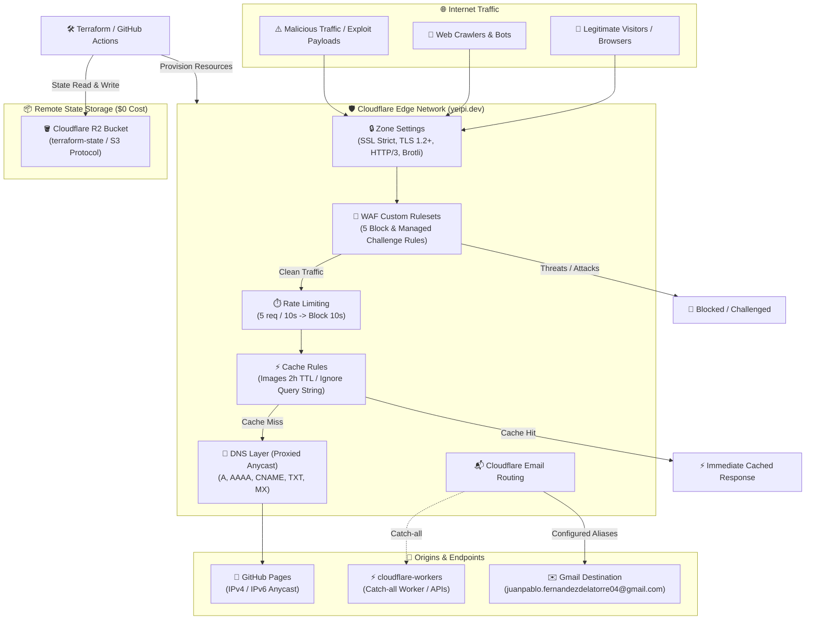
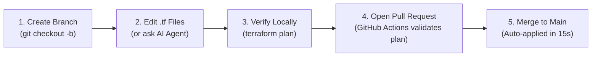

# 🌐 Cloudflare Infrastructure (`cloudflare-infra`)

Modular, production-grade Infrastructure as Code (IaC) powered by **Terraform / OpenTofu** and the **Cloudflare Provider v5 (`~> 5.0`)** to manage DNS records, perimeter security (Custom WAF Rules, Rate Limiting), edge caching, Email Routing, and global zone settings for **[`yeipi.dev`](https://yeipi.dev)**.

Remote state (`terraform.tfstate`) is securely stored at zero cost using **Cloudflare R2** via its S3-compatible API.

---

## 🏛️ Architecture Overview



### 🔗 Relationship with `cloudflare-workers`

This repository (`cloudflare-infra`) provisions and manages the foundational **DNS and Edge Infrastructure**. It coordinates with the companion repository **[`cloudflare-workers`](https://github.com/yeipis/cloudflare-workers)**:
* **Infrastructure Layer (`cloudflare-infra`):** Declares DNS records, WAF security expressions, rate limiters, cache optimization rules, and direct email forwardings.
* **Application / Serverless Layer (`cloudflare-workers`):** Implements backend APIs and the serverless email handler (`email-catch-all-reject`), which acts as the target for unmapped domain emails.

---

## 📁 Repository Structure

```text
cloudflare-infra/
├── .github/
│   └── workflows/
│       ├── terraform-check.yml       # PR validation: formatting, linting & plan
│       └── terraform-deploy.yml      # Main deployment: automatic apply on merge
├── modules/
│   ├── dns/                          # DNS records (A, AAAA, CNAME, MX, TXT)
│   │   ├── main.tf
│   │   ├── variables.tf
│   │   ├── outputs.tf
│   │   └── versions.tf
│   ├── rulesets/                     # WAF Custom, Rate Limiting & Cache Rules
│   │   ├── main.tf
│   │   ├── variables.tf
│   │   ├── outputs.tf
│   │   └── versions.tf
│   ├── email/                        # Email Routing forwarding rules
│   │   ├── main.tf
│   │   ├── variables.tf
│   │   ├── outputs.tf
│   │   └── versions.tf
│   └── zone-settings/                # SSL Strict, TLS 1.2+, HTTP/3, Brotli
│       ├── main.tf
│       ├── variables.tf
│       ├── outputs.tf
│       └── versions.tf
├── .gitignore                        # Secret & state file leak prevention
├── AGENTS.md                         # Universal AI agent instructions & context rules
├── LICENSE                           # MIT License
├── README.md                         # Project documentation and quickstart
├── backend.tf                        # S3-compatible backend targeting Cloudflare R2
├── backend.tfvars.example            # Template for local R2 backend credentials
├── main.tf                           # Root orchestrator invoking all submodules
├── variables.tf                      # Global variable declarations
├── outputs.tf                        # Summary outputs and resource IDs
├── terraform.tfvars.example          # Template for local Terraform variables
└── versions.tf                       # Terraform >= 1.5.0 and Cloudflare ~> 5.0
```

---

## 🛡️ Public Repository Security Design

> [!IMPORTANT]
> This repository is fully safe for public hosting. Zero secrets, tokens, or private keys are tracked in version control.

* **Git Ignore Policies:** `.gitignore` protects `*.tfvars`, `*.tfvars.json`, `backend.tfvars`, `*.tfstate`, and `.env*`.
* **Clean Templates:** `terraform.tfvars.example` and `backend.tfvars.example` provide placeholder configurations.
* **Least Privilege:** API tokens require only the specific permissions needed for `yeipi.dev`.

---

## 🪣 Remote State Setup with Cloudflare R2 ($0 Cost)

To configure the zero-cost remote backend on Cloudflare R2:

1. In the **Cloudflare Dashboard**, navigate to **R2 Object Storage**.
2. Create a bucket named **`terraform-state`**.
3. In the R2 sidebar, click **Manage R2 API Tokens** > **Create API Token**:
   * **Permissions:** `Object Read & Write`
   * **Scope:** Apply to bucket `terraform-state`
4. Copy the generated credentials:
   * **Access Key ID**
   * **Secret Access Key**
   * **Endpoint URL:** `https://<CLOUDFLARE_ACCOUNT_ID>.r2.cloudflarestorage.com`

---

## 🚀 Quickstart & Local Usage (New Workstation Setup)

When setting up this project on any workstation, follow these simple steps:

### 1. Clone the Repository
```bash
git clone https://github.com/yeipis/cloudflare-infra.git
cd cloudflare-infra
```

### 2. Configure Local Variables

Copy the example templates:

```powershell
# Windows (PowerShell)
Copy-Item terraform.tfvars.example terraform.tfvars
Copy-Item backend.tfvars.example backend.tfvars
```

```bash
# Linux / macOS
cp terraform.tfvars.example terraform.tfvars
cp backend.tfvars.example backend.tfvars
```

Populate `terraform.tfvars`:
```hcl
cloudflare_api_token  = "your_cloudflare_api_token_here"
cloudflare_account_id = "your_cloudflare_account_id_here"
cloudflare_zone_id    = "your_cloudflare_zone_id_here"
domain                = "yeipi.dev"
destination_email     = "juanpablo.fernandezdelatorre04@gmail.com"
```

Populate `backend.tfvars`:
```hcl
endpoint   = "https://<CLOUDFLARE_ACCOUNT_ID>.r2.cloudflarestorage.com"
access_key = "your_r2_access_key_id"
secret_key = "your_r2_secret_access_key"
```

### 3. Initialize and Apply Infrastructure

```powershell
# Initialize Terraform and connect to R2 remote backend (use quotes in PowerShell)
terraform init "-backend-config=backend.tfvars"

# Validate syntax and configuration
terraform validate

# Preview changes against live Cloudflare state
terraform plan

# Apply infrastructure changes
terraform apply
```

---

## 🔄 GitOps & Contribution Workflow

To make any infrastructure changes in the future, follow this standard GitOps workflow:



1. **Create a feature branch:**
   ```bash
   git checkout -b feat/add-new-subdomain
   ```
2. **Make your changes:** Edit or add resources in the appropriate module under `modules/`.
3. **Verify the plan locally:** Run `terraform plan` to ensure zero unintended changes.
4. **Push and open a Pull Request:** GitHub Actions runs `terraform-check.yml` to lint, validate, and post the execution plan in CI.
5. **Merge into `main`:** GitHub Actions runs `terraform-deploy.yml` to automatically apply changes to Cloudflare edge in ~15 seconds.

---

## 🤖 CI/CD with GitHub Actions

The repository includes two automated workflows in `.github/workflows/`:
1. **`terraform-check.yml` (Pull Requests):** Runs on every PR targeting `main`. Performs `terraform fmt -check`, `terraform validate`, and `terraform plan`.
2. **`terraform-deploy.yml` (Main Branch):** Runs automatically on push to `main`. Executes `terraform apply -auto-approve`.

### Required GitHub Repository Secrets

Configure the following secrets under **Settings** > **Secrets and variables** > **Actions**:

| Secret Name | Description | Source |
| :--- | :--- | :--- |
| `CLOUDFLARE_API_TOKEN` | Cloudflare API Token with Zone, DNS, WAF, Email permissions | Cloudflare Dashboard > API Tokens |
| `CLOUDFLARE_ACCOUNT_ID` | Your Cloudflare Account ID | Cloudflare Dashboard URL / Overview |
| `CLOUDFLARE_ZONE_ID` | Zone ID for `yeipi.dev` | Zone Overview page |
| `AWS_ACCESS_KEY_ID` | Cloudflare R2 Access Key ID | R2 > Manage R2 API Tokens |
| `AWS_SECRET_ACCESS_KEY` | Cloudflare R2 Secret Access Key | R2 > Manage R2 API Tokens |

---

## 📋 Managed Resources Summary

### 1. DNS (`modules/dns/`)
* **A Records (Proxied):** Points apex `yeipi.dev` to GitHub Pages Anycast IPv4 (`185.199.111.153`, `185.199.110.153`, `185.199.109.153`, `185.199.108.153`).
* **AAAA Records (Proxied):** Points apex `yeipi.dev` to GitHub Pages Anycast IPv6 (`2606:50c0:8000::153`, `2606:50c0:8001::153`, `2606:50c0:8002::153`, `2606:50c0:8003::153`).
* **CNAME Records (Proxied):**
  * `greenfleet.yeipi.dev` -> `yeipi.dev`
  * `parkit.yeipi.dev` -> `yeipi.dev`
  * `poketools.yeipi.dev` -> `yeipi.dev`
  * `www.yeipi.dev` -> `yeipis.github.io`
* **MX Records:** Cloudflare Email Routing endpoints (`route1`, `route2`, `route3.mx.cloudflare.net`).
* **TXT Records:** DKIM (`cf2024-1._domainkey`), DMARC (`_dmarc`), GitHub Pages domain verification challenge, and SPF (`v=spf1 ...`).

### 2. Security & Rulesets (`modules/rulesets/`)
* **WAF Custom Rules (`http_request_firewall_custom`):**
  1. `[WAF] Bad Bots & Crawlers` (Blocks malicious user agents, disallowed HTTP methods, malicious ASNs).
  2. `[WAF] Exploiting Fix` (Mitigates SQL injection, XSS vectors, path traversals, PHP/RCE probes).
  3. `[WAF] Block Malicious Traffic & Files` (Blocks automated scanners and probes targeting `.env`, `.git`, `.aws`, admin panels).
  4. `[WAF] Bad ASNs & Method Fix` (Blocks known attack ASNs and anomaly queries).
  5. `[WAF] Thread Check Challenge` (Managed Challenge for legacy/anomalous HTTP clients).
* **Rate Limiting (`http_ratelimit`):**
  * `[Rate Limit] Anti-DDoS & API Protection`: 5 requests per 10 seconds on `/` and `/api/*`, blocks for 10 seconds.
* **Cache Rules (`http_request_cache_settings`):**
  * `[Cache] Optimización de Imágenes (Ignorar Query)`: 2-hour Edge TTL for `.png`, `.jpg`, `.svg`, `.webp`, and `/img/`, ignoring query strings in the cache key.

### 3. Email Routing (`modules/email/`)
* Forwards inbound emails from aliases to `juanpablo.fernandezdelatorre04@gmail.com`:
  * `admin@yeipi.dev`
  * `contacto@yeipi.dev`
  * `contact@yeipi.dev`
  * `jp@yeipi.dev`
  * `juanpablo@yeipi.dev`

### 4. Zone Settings (`modules/zone-settings/`)
* `ssl = "strict"`
* `always_use_https = "on"`
* `min_tls_version = "1.2"`
* `http3 = "on"`
* `brotli = "on"`

---

## 🤖 Universal AI Agent Support (`AGENTS.md`)

This repository includes an [AGENTS.md](AGENTS.md) file following the open repository guidelines standard. It provides immediate contextual awareness, coding standards, and security invariants for:
* **Google Antigravity / Gemini CLI**
* **Claude / Claude Code**
* **ChatGPT / OpenAI Agents**
* **Cursor, Windsurf, Aider, Devin, and OpenHands**

Any agent initialized in this repository will automatically adhere to the Cloudflare Provider v5 conventions, English-only documentation standards, and public security guardrails.

---

## 📚 Official Documentation & References

### Cloudflare Terraform Provider (v5)
* [Cloudflare Provider on Terraform Registry](https://registry.terraform.io/providers/cloudflare/cloudflare/latest/docs) — Official provider documentation, schemas, and argument references.
* [Cloudflare Provider v5 Migration Guide](https://registry.terraform.io/providers/cloudflare/cloudflare/latest/docs/guides/migration_v5) — Guide detailing breaking changes and Plugin Framework transitions in v5.
* [`cloudflare_dns_record` Documentation](https://registry.terraform.io/providers/cloudflare/cloudflare/latest/docs/resources/dns_record) — Resource specification for DNS management.
* [`cloudflare_ruleset` Documentation](https://registry.terraform.io/providers/cloudflare/cloudflare/latest/docs/resources/ruleset) — Resource specification for WAF, Rate Limiting, and Cache rulesets.
* [`cloudflare_email_routing_rule` Documentation](https://registry.terraform.io/providers/cloudflare/cloudflare/latest/docs/resources/email_routing_rule) — Resource specification for Email Routing.
* [`cloudflare_zone_setting` Documentation](https://registry.terraform.io/providers/cloudflare/cloudflare/latest/docs/resources/zone_setting) — Resource specification for TLS, SSL, HTTP/3, and Brotli settings.

### Cloudflare Developer Documentation
* [Cloudflare DNS Documentation](https://developers.cloudflare.com/dns/) — DNS management, Anycast routing, and proxying concepts.
* [Cloudflare Ruleset Engine](https://developers.cloudflare.com/ruleset-engine/) — Ruleset phases, execution order, and Wireshark-inspired expression language.
* [Cloudflare Web Application Firewall (WAF)](https://developers.cloudflare.com/waf/) — Custom rules, managed rules, and threat mitigation.
* [Cloudflare Rate Limiting Rules](https://developers.cloudflare.com/waf/rate-limiting-rules/) — DDoS mitigation and API request rate limiting.
* [Cloudflare Cache Rules](https://developers.cloudflare.com/cache/how-to/cache-rules/) — Edge TTL, cache keys, and asset caching strategies.
* [Cloudflare Email Routing](https://developers.cloudflare.com/email-routing/) — Inbound routing, custom addresses, and DNS MX/SPF setup.
* [Cloudflare R2 S3 Compatibility API](https://developers.cloudflare.com/r2/api/s3/api/) — Documentation on S3 API endpoints and authentication for R2 storage.
* [Cloudflare SSL/TLS Encryption Modes](https://developers.cloudflare.com/ssl/origin-configuration/ssl-modes/) — Guide on Full, Strict, and Flexible SSL encryption modes.

### HashiCorp Terraform & OpenTofu
* [Terraform S3 Backend Reference](https://developer.hashicorp.com/terraform/language/settings/backends/s3) — Configuration parameters for S3-compatible remote state backends.
* [Terraform Module Design Best Practices](https://developer.hashicorp.com/terraform/language/modules/develop) — Structural standards for reusable Terraform modules.
* [OpenTofu Documentation](https://opentofu.org/docs/) — Community-driven open-source fork documentation.

### GitHub Actions CI/CD
* [GitHub Actions Workflow Syntax](https://docs.github.com/en/actions/writing-workflows/workflow-syntax-for-github-actions) — Complete reference for `.github/workflows/` YAML syntax.
* [Encrypted Secrets in GitHub Actions](https://docs.github.com/en/actions/security-for-github-actions/security-guides/using-secrets-in-github-actions) — Securing sensitive API tokens and credentials in CI/CD runners.
* [`hashicorp/setup-terraform` GitHub Action](https://github.com/hashicorp/setup-terraform) — Official HashiCorp action for executing Terraform commands in CI/CD.

---

## 📄 License

Distributed under the MIT License. See [LICENSE](LICENSE) for full details.